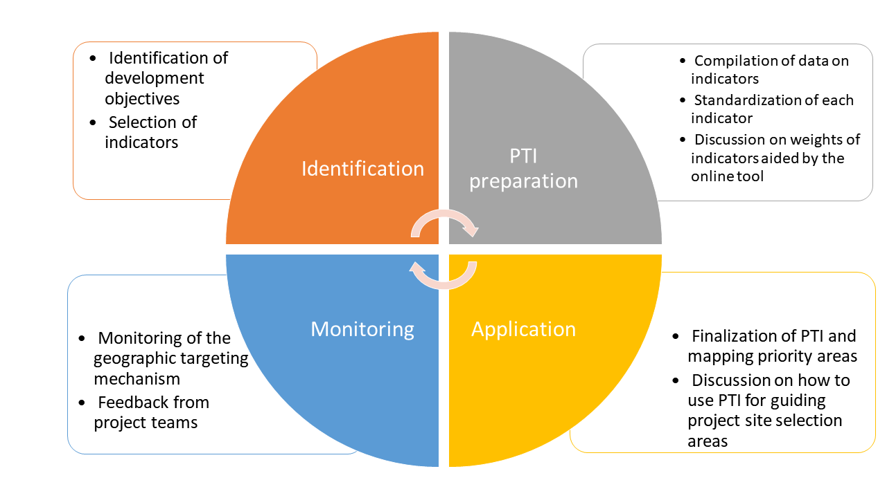
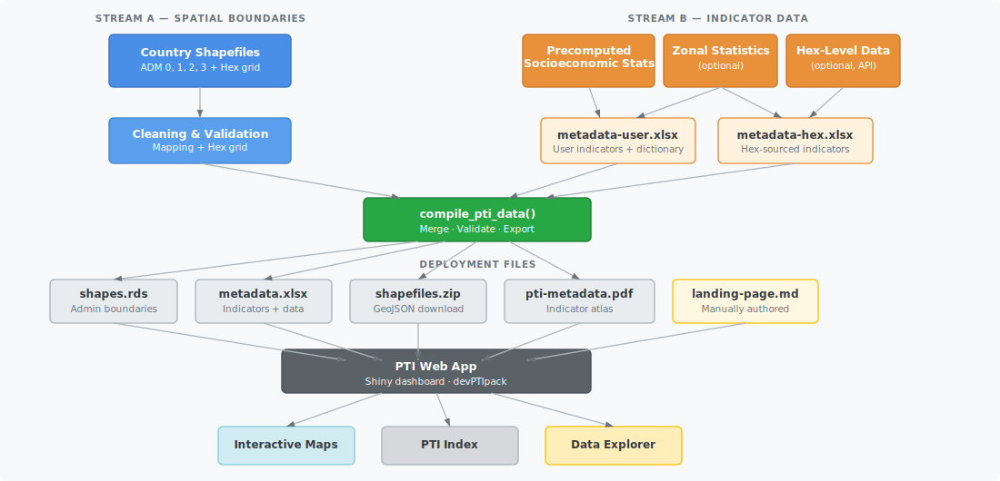

```{r setup_lib, include=FALSE}
knitr::opts_chunk$set(
  message = FALSE,
  echo = FALSE,
  warning = FALSE,
  error = FALSE,
  cache = FALSE
)
```

# Introduction

Tracking how the World Bank's portfolio of activities aligns with evolving
circumstances in specific countries is challenging. World Bank teams engage with
countries through strategic and prioritization exercises, such as the Country
Partnership Framework (CPF) and the Systematic Country Diagnostic (SCD). To
maximize the development benefits of activities identified under these
exercises, it is essential to ensure that projects and programs evolve with
changing circumstances while reaching the areas that are most in need.

The Project Targeting Index (PTI) offers a framework for project and country
teams to match development objectives with geographic project site selection
(Finn & Masaki, 2020; Nguyen & Hoogeveen, 2018). Teams can ensure that project
site selection aligns with the country strategy, and the country management unit
(CMU) can monitor consistency between project sites and the strategy. Spatially
targeting the Bank's interventions based on objective criteria and evidence
helps bring transparency to project site selection and promote efficiency in
reaching intended beneficiaries. Teams can use the PTI online dashboard to
track fast-changing emergency situations (Masaki et al., 2022). The dashboard
serves both as a database of subnational indicators and as a user-friendly tool
for PTI calculation.

The purpose of this document is to provide a guideline on how PTI works, what
data components feed into the PTI dashboard, and what methodological aspects
underpin the composite index. The PTI process comprises four components (@fig-pti-process). The first two
describe the workflow — what teams do — while the third is a reference on
how the composite index is constructed, and the fourth addresses ongoing
maintenance:

1. [Identification](#identification) — define development objectives and select indicators;
2. [PTI preparation](#pti-prep) — build the data pipeline and deploy the dashboard;
3. [Methodology](#methodology) — how the composite index is constructed; and
4. [Monitoring](#monitoring) — keep the PTI current as conditions change.

{#fig-pti-process width="100%"}

---

# Identification {#identification}


## Determine thematic areas of focus

The PTI process starts with the identification of development objectives. A
clear set of development objectives that can be measured by data and evidence,
established in close coordination with the respective country teams, lays the
groundwork for PTI mapping. Goals outlined in a Country Partnership Framework
(CPF) are a good starting point to guide selection of development objectives.
In the case of
Zambia^[The PTI dashboard for Zambia is available from
https://wbg-poverty-gp.shinyapps.io/zamPTI/], for instance, there are three
thematic areas taken directly from
[CPF FY19-23](https://documents1.worldbank.org/curated/en/805841545925652368/pdf/Zambia-Country-Partnership-Framework-for-the-Period-FY19-FY23.pdf):

1. More even territorial development with opportunities and jobs for the
   rural poor
2. Public services and social protection for job participation
3. Institutions for resilience

## Identify key indicators under each thematic area

Once the key development objectives or thematic areas of focus are determined,
the next step is to identify indicators pertaining to each of those objectives
or areas. Since the PTI informs spatial targeting, these indicators need to be
available at a subnational level (for example, villages, districts, regions,
provinces). People most familiar with the country context — project teams,
country experts, and sector specialists — should provide inputs on indicator
selection. Teams may also consult GIS specialists, as a rich source of
high-resolution socio-economic data is now available to inform spatial targeting
at a highly disaggregated level.

---

# PTI Preparation {#pti-prep}

The next step in the PTI process is to create a PTI dashboard. This dashboard
primarily serves two purposes:

1. A **one-stop shop** that offers a wide range of subnational indicators
   readily available and accessible; and
2. A **user-friendly tool** to make the calculation of a PTI easy, flexible, and
   adaptable.

Building a PTI app requires two categories of inputs — spatial boundaries and
indicator data — which are processed through a reproducible pipeline and
compiled into four deployment-ready files that power the web application.
@fig-pti-data-flow illustrates this workflow.

{#fig-pti-data-flow width="100%"}

## Spatial boundaries

The foundation of any PTI dashboard is a set of validated administrative
boundary shapefiles. These define the geographic units at which indicators will
be displayed and the PTI will be calculated. A typical PTI app includes:

- **Country boundary** (ADM 0) — required as the outer envelope.
- **Subnational administrative levels** (ADM 1, 2, 3, etc.) — regions,
  districts, communes, or whatever administrative divisions are relevant.
- **Hexagonal grid** (optional) — a uniform H3 hexagonal grid covering the
  country, useful for indicators derived from raster data (population,
  night-time lights, accessibility). Hexagons avoid the modifiable areal unit
  problem (the fact that analytical results can change depending on how
  geographic boundaries are drawn) introduced by irregular administrative
  polygons.

All spatial layers are cleaned, validated, and combined into a single
`shapes.rds` file with a parent-child hierarchy linking each administrative
unit to its parent.

## Indicator data sources

Indicator data feeding into the PTI dashboard typically comes from three
sources:

1. **Precomputed socioeconomic statistics** — survey-derived indicators (DHS,
   MICS, household budget surveys, population census), administrative records,
   or other tabulated data already aggregated at subnational levels.

2. **Zonal statistics** (optional) — indicators extracted from raster surfaces
   (e.g., population density from WorldPop, night-time lights, vegetation
   indices) by computing summary statistics within each administrative polygon.

3. **Hex-level data** (optional) — pre-computed indicator values at H3 hexagonal
   resolution, accessed through an API or prepared as local parquet files.

These indicator sources are combined with descriptive metadata into two
intermediate Excel workbooks:

- **`metadata-user.xlsx`** — the user-prepared indicator dictionary with
  variable descriptions, pillar assignments (i.e., which thematic area or
  development objective each indicator belongs to), and per-admin-level data
  sheets.
- **`metadata-hex.xlsx`** — hex-sourced indicators with auto-populated metadata,
  produced when the hex data pipeline is used.

## Compilation

The `compile_pti_data()` function merges all intermediate inputs, re-validates
the combined data, and produces four deployment-ready files:

| File                | Contents                                            |
| ------------------- | --------------------------------------------------- |
| `shapes.rds`        | Validated spatial boundaries for all admin levels   |
| `metadata.xlsx`     | Merged indicator dictionary and data                |
| `shapefiles.zip`    | GeoJSON exports of each admin layer for download    |
| `pti-metadata.pdf`  | Printable indicator atlas (one map per indicator)   |

A fifth file, `landing-page.md`, is manually authored and provides the content
for the dashboard's landing page.

These five files, together with a short launch script, are all that is needed to
deploy the PTI web application locally or to a hosting service such as Posit
Connect.

## Data quality assurance

It is crucial to ensure the quality of the data through manual inspection and
standardized metadata reports. Key factors that must be accounted for during
quality assurance include:

1. **Missing observations** — regions with missing values receive no targeting
   priority in the PTI calculation.
2. **Presence of variance** — if all regions have the same value for an
   indicator, z-score normalization will be impossible and the indicator will
   contribute nothing to the index.
3. **Extreme observations** — outliers and the magnitude of variables should be
   carefully inspected, as they can disproportionately influence the
   standardized scores.
4. **Spatial boundary quality** — boundaries should be simple and lightweight
   enough to render in a web browser, free of holes and missing polygons, and
   carry unique names and regional identifiers.

::: {.callout-tip}
## Getting started
For step-by-step instructions on setting up a new PTI project, preparing data,
and deploying the dashboard, see the
[Build a PTI](build-pti.html) tutorial series.
:::

---

# Methodology {#methodology}

The previous sections described the PTI workflow — identifying objectives,
preparing data, and building a dashboard. This section turns to the
methodology: how the composite index is actually constructed.

The initial PTI methodology was proposed as part of “Approaches to Targeting in
South Sudan” (World Bank, 2019) and has been implemented in the `devPTIpack` R
package. The PTI is a composite index of several development indicators chosen
to inform geographical targeting. The key topics are normalization, index
calculation, the role of weights, and how data is projected across spatial
levels.


## Normalization (z-score standardization) {#normalization}

Different indicators are measured in different units and have vastly different
scales. For example, the number of poor people in a district might range from
thousands to millions, while the share of the population with access to
electricity ranges from 0 to 1. If these raw values were combined directly, the
indicator with the larger absolute values would dominate the composite index.

To place all indicators on a common, comparable scale, the PTI standardizes
them using **z-score normalization**, transforming each indicator to have a mean
of 0 and a standard deviation of 1:

$$x_{ij}^* = \frac{x_{ij} - \bar{x}_j}{s_j}$$

where:

- $x_{ij}$ is the value of indicator $j$ in region $i$,
- $\bar{x}_j$ is the mean of indicator $j$ across all regions, and
- $s_j$ is the standard deviation of indicator $j$.

After standardization, each indicator's z-score tells you how many standard
deviations a region's value lies above or below the national mean. A z-score of
+1.5 means the region is 1.5 standard deviations above average; a z-score of
−0.8 means it is 0.8 standard deviations below average.


### Normalization is performed per spatial level

A critical aspect of the PTI normalization is that **z-scores are computed
independently at each spatial level of aggregation**. If the poverty rate is
available at ADM 1 (5 regions) and at ADM 2 (30 districts), the mean and
standard deviation used for normalization are computed separately among the 5
regions and among the 30 districts, respectively.

This is necessary because the statistical distribution of an indicator changes
with the level of aggregation: district-level values typically show more
variation than regional averages. Normalizing at each level ensures that the
z-scores reflect a region's position relative to its true peer group, rather
than being distorted by mixing fundamentally different distributions.

As a consequence, the same raw value can yield different z-scores depending on
the spatial level at which it is normalized.


### Worked example: poverty rate at ADM 1 vs. ADM 2

Consider a country with 3 regions (ADM 1), each containing several districts
(ADM 2). The poverty rate (%) is available at both levels:

**ADM 1 normalization** (3 regions):

| Region   | Poverty rate (%) | z-score          |
| -------- | :--------------: | :--------------: |
| North    | 45               | +1.12            |
| Central  | 30               | −0.32            |
| South    | 25               | −0.80            |

Mean = 33.3%, SD = 10.4%. The North region, with the highest poverty, gets
a positive z-score.

**ADM 2 normalization** (all 8 districts across the three regions):

| District       | Region  | Poverty rate (%) | z-score          |
| -------------- | ------- | :--------------: | :--------------: |
| North-A        | North   | 52               | +1.06            |
| North-B        | North   | 43               | +0.39            |
| North-C        | North   | 38               | +0.01            |
| Central-West   | Central | 35               | −0.22            |
| Central-East   | Central | 28               | −0.74            |
| South-West     | South   | 25               | −0.97            |
| South-Central  | South   | 22               | −1.19            |
| South-East     | South   | 60               | +1.66            |

Mean = 37.9%, SD = 13.3%. Notice that the South-East district has a very
high poverty rate that was hidden within the South region's ADM 1 average.
The z-score distribution at ADM 2 reveals subnational variation that the
coarser ADM 1 normalization cannot capture.


## PTI index construction {#index-construction}

Once all indicators are normalized, the PTI composite index for a given
targeting priority $p$ is computed as a weighted sum of the standardized
indicators:

$$PTI_p = \sum_{j=1}^{n} x_{ij}^* \cdot w_j$$

where:

- $x_{ij}^*$ is the z-score of indicator $j$ in region $i$, and
- $w_j$ is the weight assigned to indicator $j$.

These calculations produce a single index number for each region. The regions
are then ranked and divided into priority classes — typically 3 to 5 groups of
equal size (quantiles). The region with the highest PTI value is assigned to
**Priority 1** (highest need), while the region with the lowest PTI value falls
into the lowest priority class.


### The role of positive and negative weights

Users have flexibility to make weights **positive or negative** to control the
direction of each indicator's contribution to the PTI.

- A **positive weight** means that higher values of the indicator push a region
  toward **higher priority** (Priority 1).
- A **negative weight** means that higher values of the indicator push a region
  toward **lower priority**.

This distinction is essential when combining indicators that point in opposite
directions relative to the targeting objective. Consider a scenario where the
goal is to target areas with the highest poverty and the lowest access to
infrastructure:

| Variable                | Weight | Effect on PTI                                |
| ----------------------- | :----: | -------------------------------------------- |
| Poverty rate            | +1     | Higher poverty → higher priority             |
| Electricity grid access | −1     | Higher access → **lower** priority           |

If both variables were assigned a positive weight, the PTI would identify as
top priority those regions with *both* the highest poverty *and* the highest
electricity access — clearly counterintuitive. Setting the electricity access
weight to −1 reverses its effect: the PTI now scores highest in regions where
poverty is high *and* electricity access is low, which aligns with the
targeting objective.

It is also possible to assign weights **greater than 1** (or less than −1) to
emphasize a variable's relative importance compared to others. For example,
setting the poverty rate weight to +2 and the electricity access weight to −1
makes the poverty dimension twice as influential in determining priority areas.


### Worked example: PTI with two indicators

Using the ADM 2 poverty z-scores from the example above, suppose we add a
second indicator — electricity grid access — which has been independently
normalized at ADM 2 to produce its own set of z-scores. We compute the PTI
with weights +1 (poverty) and −1 (electricity):

| District       | Poverty z | Electricity z | PTI = (+1 × Pov) + (−1 × Elec) |
| -------------- | :-------: | :-----------: | :-----------------------------: |
| North-A        | +1.06     | −0.90         | +1.96                           |
| North-B        | +0.39     | −0.40         | +0.79                           |
| North-C        | +0.01     | +0.20         | −0.19                           |
| Central-West   | −0.22     | +0.60         | −0.82                           |
| Central-East   | −0.74     | +1.10         | −1.84                           |
| South-West     | −0.97     | +0.80         | −1.77                           |
| South-Central  | −1.19     | +1.40         | −2.59                           |
| South-East     | +1.66     | −1.50         | +3.16                           |

The South-East district scores highest: it has both the most severe poverty
and the lowest electricity access. The South-Central district scores lowest:
relatively low poverty combined with high electricity access.

{#fig-sudan-example
width="100%"}

<!-- TODO: Add a figure showing the PTI weight selection interface -->


## Data projection across spatial levels {#data-projection}

The index formula in the previous section assumes every indicator is available
at the target spatial level. In practice, not all indicators are available at
every level: some may
exist only at ADM 1 (regions) while others are available at ADM 2 (districts)
or at the hexagonal grid level. The PTI handles this mismatch through **data
projection** — a set of rules that govern how indicator values move between
spatial levels.


### Top-down projection (coarse → fine)

When an indicator is available at a coarser level (e.g., ADM 1) but the PTI is
being calculated at a finer level (e.g., ADM 2), the indicator's **normalized
z-score is projected downward** by repeating the parent region's value at
each child unit.

Critically, **normalization happens before projection**:

1. The indicator is first normalized among the units at its native level
   (e.g., among the 5 ADM 1 regions).
2. The resulting z-scores are then copied verbatim to every child unit at the
   finer level (e.g., each district inherits its parent region's z-score).

The indicator is **not re-normalized** at the finer level after projection.
Re-normalizing would erase the regional-level information the indicator was
intended to capture — the z-score reflects how a region compares to all
regions, and that comparative meaning must be preserved when the score is used
at the district level.


### Worked example: projection from ADM 1 to ADM 2

Suppose "school enrollment rate" is available only at ADM 1:

**Step 1 — Normalize at ADM 1:**

| Region   | Enrollment (%) | z-score |
| -------- | :------------: | :-----: |
| North    | 72             | −1.07   |
| Central  | 85             | +0.91   |
| South    | 80             | +0.15   |

Mean = 79.0%, SD = 6.6%.

**Step 2 — Project to ADM 2 (copy parent z-score):**

| District       | Parent region | Enrollment z-score |
| -------------- | ------------- | :----------------: |
| North-A        | North         | −1.07              |
| North-B        | North         | −1.07              |
| North-C        | North         | −1.07              |
| Central-West   | Central       | +0.91              |
| Central-East   | Central       | +0.91              |
| South-West     | South         | +0.15              |
| South-Central  | South         | +0.15              |
| South-East     | South         | +0.15              |

All districts within the same region receive identical z-scores for this
indicator. When combined with district-level indicators (like the poverty rate),
the PTI still differentiates among districts — the projected regional indicator
simply adds a uniform regional-level signal.


### Bottom-up aggregation: data is NOT aggregated upward

The PTI pipeline **does not aggregate fine-level data upward** to coarser
levels. If an indicator exists at ADM 2, it is not averaged or summed to
produce ADM 1 values. Each level uses only the data that was originally
prepared at that level.

The one exception is **hexagonal grid data**, where bottom-up aggregation is
performed from hex cells to administrative polygons. In this case, the
aggregation method is **case-dependent**: the appropriate function (mean,
sum, population-weighted mean, etc.) and weighting scheme (population,
area, or none) are specified per indicator in the metadata workbook, based on
the indicator's statistical nature. For example:

| Indicator           | Aggregation function | Weighting |
| ------------------- | -------------------- | --------- |
| Night-time lights   | Mean                 | None      |
| Population count    | Sum                  | None      |
| Poverty rate        | Mean                 | Population-weighted |
| Flood exposure      | Sum                  | None      |

Hex-to-admin aggregation is always performed **directly from hex to each admin
level** (hex → ADM 1, hex → ADM 2, etc.), never chained through intermediate
levels (never hex → ADM 2 → ADM 1). Chaining would compound rounding and
boundary-assignment errors at each intermediate step, producing less accurate
results than a single direct aggregation.


## Weight identification {#weight-identification}

Identifying appropriate weights for the PTI is fundamentally a
**consensus-driven process**. It requires careful deliberation among project
stakeholders, including the technical team and government counterparts. The
challenge lies in balancing technical rigor with practical considerations, as
the choice of weights can significantly influence which areas are prioritized.
This process is inherently iterative and may involve context-specific
judgments, reflecting the complexity of development targeting.

The steps involved in finalizing weights are as follows:

1. **Experiment** — The team uses the online PTI platform to experiment with
   various combinations of indicators and weights. This allows for dynamic
   exploration of how different choices affect the output.

2. **Sensitivity analysis** — The sensitivity of the ranking of priority areas
   to these permutations is examined, often using rank correlation analyses.
   This step reveals how robust or volatile the prioritization is in response
   to changes in weights and indicator selection.

3. **Consensus** — The team consolidates the weights and indicators based on
   insights from the sensitivity analysis, as well as through discussions
   within the project team and with government representatives. This
   collaborative approach ensures that chosen weights reflect both analytical
   findings and stakeholder perspectives.

In practice, the PTI dashboard supports this process directly: users can toggle
indicators on and off, adjust weights with sliders, and immediately see how the
priority map responds. A ranking is considered robust when the top-priority
areas remain largely stable across reasonable weight variations — for example,
when the same districts appear in Priority 1 regardless of whether the poverty
weight is set to +1 or +2.

Choosing appropriate weights always involves some degree of subjectivity. The process must be transparent and carefully evaluated, because even small
changes in weights can substantially alter the ranking of priority areas —
especially when the selected variables are only loosely correlated or when few
variables are used in constructing the PTI.

For instance, in the South Sudan example, the poverty rate and the number of
poor are only weakly correlated (World Bank, 2019). This means that adjusting
their weights can lead to substantial shifts in which counties are identified as
highest priority. With only a few variables in play, the impact of weighting
decisions is even more pronounced, underscoring the importance of careful and
collaborative evaluation.

<!-- TODO: Add figure showing sensitivity analysis example -->


---

# Monitoring {#monitoring}

The PTI should not be a static tool. As circumstances on the ground change or
project objectives evolve, the dashboard's indicators and weights should be
revisited and updated.

Beyond recalibration, project teams working in priority areas will inevitably
encounter unforeseen implementation challenges — logistical bottlenecks,
political dynamics, infrastructure gaps — that no survey or administrative
dataset can fully anticipate. Recording these experiences is essential: future
project teams benefit greatly from lessons learned at specific sites.

For these reasons, identifying priority areas should not be based solely on the
PTI. Teams should complement the index with qualitative field knowledge, and
systematically document site-level challenges so that future targeting decisions
are informed by both quantitative evidence and operational experience.


---

# References {.unnumbered}

- Finn, A., & Masaki, T. (2020). *Subnational Targeting of Project Sites Using
  Project Targeting Index (PTI)*. Poverty and Equity Notes: Tools & Methods,
  No. 33. World Bank, Washington, DC.
  <https://openknowledge.worldbank.org/handle/10986/34311>

- Masaki, T., Bosch, L., Finn, A., Meyer, M., Haider, S. Z., & Bukin, E.
  (2022). *Dashboards for development: the power of geospatial data at your
  fingertips*. Poverty and Equity Notes, Issue 47. World Bank, Washington,
  DC. <http://documents.worldbank.org/curated/en/099552206032228352>

- Nguyen, N. T. V., & Hoogeveen, J. (2018). *Assessing the poverty footprint
  of World Bank projects at sub-national levels*. Poverty and Equity Notes:
  Tools & Methods, No. 16. World Bank, Washington, DC.

- World Bank. (2019). *Approaches to targeting in South Sudan: Strengthening
  targeting — South Sudan — Guidance framework*. Washington, DC: World Bank
  Group.
  <http://documents.worldbank.org/curated/en/325101561441344607>

- World Bank. (2022a). *Pakistan Portfolio Footprint Analysis*. Washington, DC:
  World Bank Group.

- World Bank. (2022b). *2022 Summer University: Introduction to R and R-shiny as
  Tools for Building Interactive Geospatial Dashboards*.
